# Curso de Manipulacion y Analisis de Datos con Pandas y Python

- [Curso de Manipulacion y Analisis de Datos con Pandas y Python](#curso-de-manipulacion-y-analisis-de-datos-con-pandas-y-python)
  - [Modulo 1 Comenzando con pandas](#modulo-1-comenzando-con-pandas)
    - [Clase 1 Que es pandas](#clase-1-que-es-pandas)
      - [Ventajas](#ventajas)
      - [Desventajas](#desventajas)
    - [Clase 2 Primeros pasos con Google Colab: configuracion del entorno de trabajo](#clase-2-primeros-pasos-con-google-colab-configuracion-del-entorno-de-trabajo)
    - [Clase 3 Series e Indexacion y seleccion de datos](#clase-3-series-e-indexacion-y-seleccion-de-datos)
    - [Clase 4 De paneles de datos al DataFrame](#clase-4-de-paneles-de-datos-al-dataframe)
    - [Clase 5 Indexado y manejo de archivos CSV](#clase-5-indexado-y-manejo-de-archivos-csv)
      - [Integracion de google drive y directorios](#integracion-de-google-drive-y-directorios)
      - [Save and load operations](#save-and-load-operations)
    - [Clase 6 Conexion con bases de datos tipo SQL](#clase-6-conexion-con-bases-de-datos-tipo-sql)
      - [Como usar Pandas y Python para conectar con tu base de datos SQL](#como-usar-pandas-y-python-para-conectar-con-tu-base-de-datos-sql)
    - [Clase 7 Ventajas y desventajas de los formatos de importar y guardado](#clase-7-ventajas-y-desventajas-de-los-formatos-de-importar-y-guardado)
  - [Modulo 2 Funcionalidades basicas y esenciales de pandas](#modulo-2-funcionalidades-basicas-y-esenciales-de-pandas)
    - [Clase 8 Formatos de lectura para cargar y guardar DataFrames](#clase-8-formatos-de-lectura-para-cargar-y-guardar-dataframes)
    - [Clase 9 Tipos de Variables que componen un data frame](#clase-9-tipos-de-variables-que-componen-un-data-frame)
    - [Clase 10 Estructuras de dataframes en detalle](#clase-10-estructuras-de-dataframes-en-detalle)
    - [Clase 11 Borrar filas, columnas y copiar información](#clase-11-borrar-filas-columnas-y-copiar-información)
  - [Modulo 3 Aplicando pandas](#modulo-3-aplicando-pandas)
    - [Clase 12 Funciones matematicas](#clase-12-funciones-matematicas)
    - [Clase 13 De paneles de datos al DataFrame](#clase-13-de-paneles-de-datos-al-dataframe)
    - [Clase 14 Funciones mas complejas y lambdas](#clase-14-funciones-mas-complejas-y-lambdas)
    - [Clase 14 Multiples índices](#clase-14-multiples-índices)
    - [Clase 15 Cómo trabajar con variables tipo texto en Pandas](#clase-15-cómo-trabajar-con-variables-tipo-texto-en-pandas)
    - [Clase 16 Concatenación de DataFrames: concat y append](#clase-16-concatenación-de-dataframes-concat-y-append)
    - [Clase 17 Merge de DataFrames](#clase-17-merge-de-dataframes)
    - [Clase 18 omo lidiar con datos faltantes en tus DataFrames](#clase-18-omo-lidiar-con-datos-faltantes-en-tus-dataframes)
    - [Clase 19 Group by](#clase-19-group-by)
    - [Clase 20 Como lidiar con datos duplicados en Pandas](#clase-20-como-lidiar-con-datos-duplicados-en-pandas)
    - [Clase 21 Aggregation y groupby](#clase-21-aggregation-y-groupby)
    - [Clase 22 Group By: extraer valor con variables categóricas](#clase-22-group-by-extraer-valor-con-variables-categóricas)
    - [Clase 23 Tablas dinámicas con Pivot Table](#clase-23-tablas-dinámicas-con-pivot-table)
    - [Clase 24 Series de Tiempo](#clase-24-series-de-tiempo)
    - [Clase 25 Series de Tiempo: variables nulas](#clase-25-series-de-tiempo-variables-nulas)
    - [Clase 26 Visualización y graficacion de datos](#clase-26-visualización-y-graficacion-de-datos)
  - [Modulo 4 Contenido extra](#modulo-4-contenido-extra)
    - [Clase 27 Iniciando una rutina típica de manejo de datos](#clase-27-iniciando-una-rutina-típica-de-manejo-de-datos)
    - [Clase 28 Preprocesamiento de datos: terminando de preparar y limpiar los datasets](#clase-28-preprocesamiento-de-datos-terminando-de-preparar-y-limpiar-los-datasets)
    - [Clase 29 Análisis de datos](#clase-29-análisis-de-datos)

## Modulo 1 Comenzando con pandas

### Clase 1 Que es pandas

El termino **Pandas** viene de Panel Datas,inventado por West McKinney.

#### Ventajas

- Reduce lineas de código
- Diseñada especialmente para análisis
- API fácil y concisa
- Multiples funciones
  
#### Desventajas

- COmpatibilidad con matrices 3 (numpy)
- Curva de aprendizaje lenta

### Clase 2 Primeros pasos con Google Colab: configuracion del entorno de trabajo

Ingresamos a colab <https://colab.research.google.com/drive/10aWN9XYtUnhUZal-UWDhNUR8m0X3sE_C>

Este servicio esta basado en jupyter notebooks.

- Operaciones Basicas de python en colab/jupyter

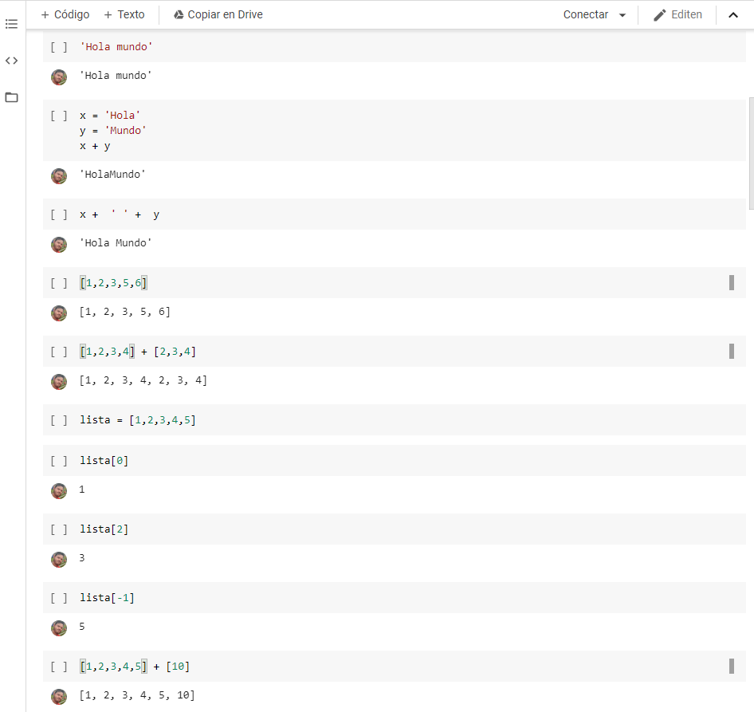

- Operaciones básicas de numpy

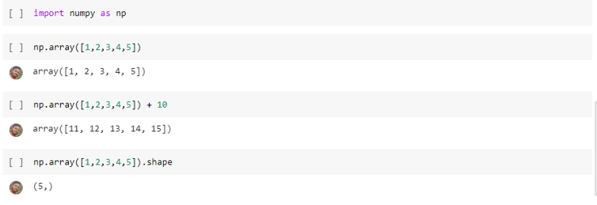

- Operaciones con matrices de numpy

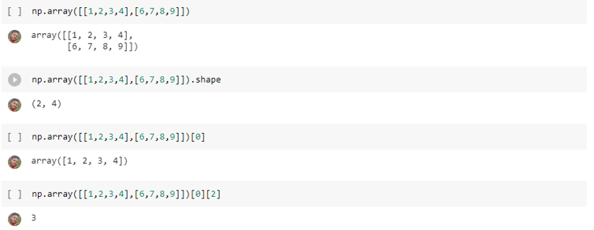

### Clase 3 Series e Indexacion y seleccion de datos

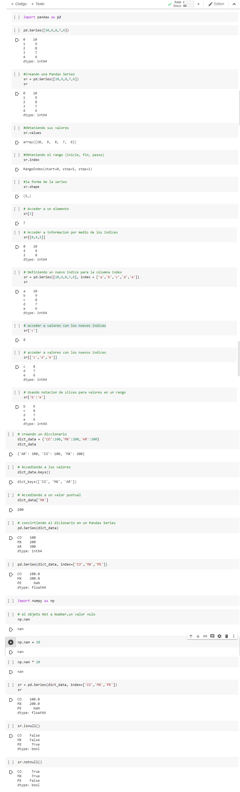

### Clase 4 De paneles de datos al DataFrame

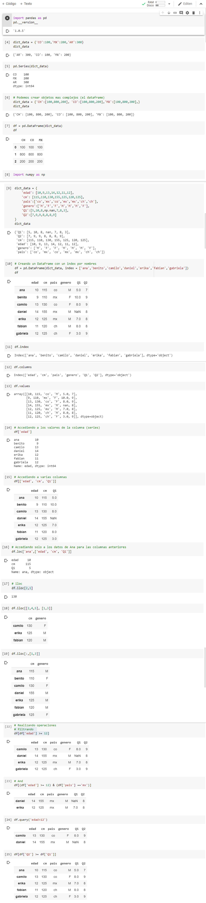

### Clase 5 Indexado y manejo de archivos CSV

#### Integracion de google drive y directorios

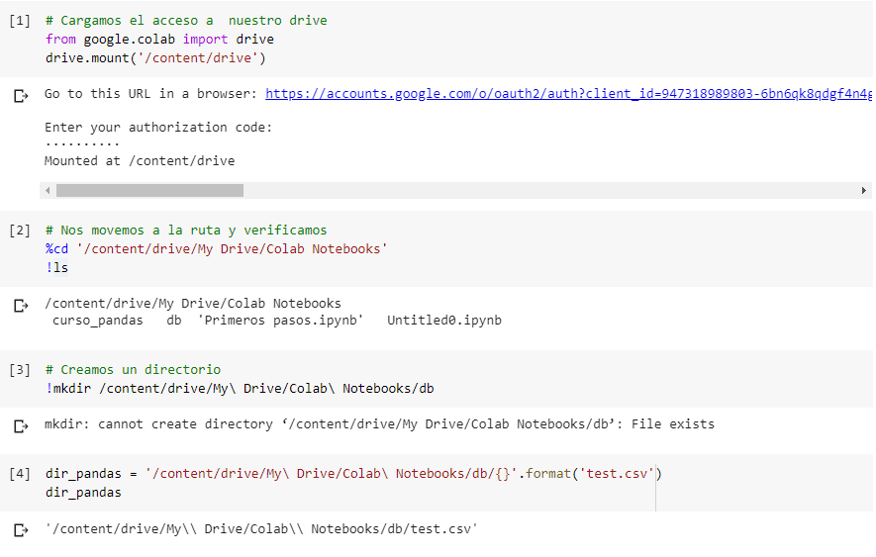

#### Save and load operations

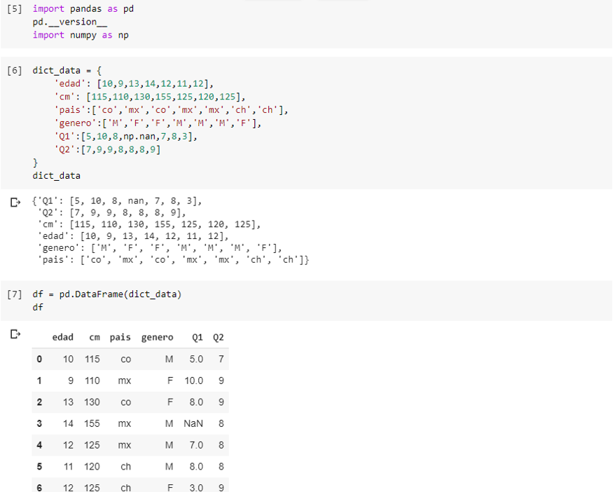

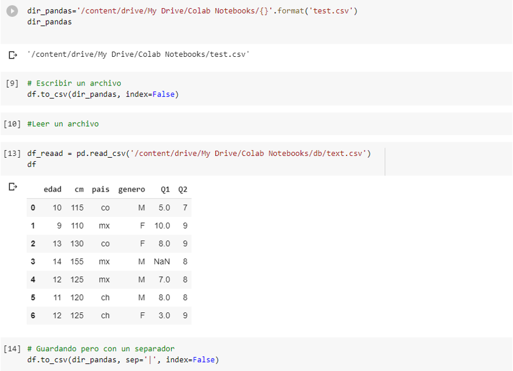

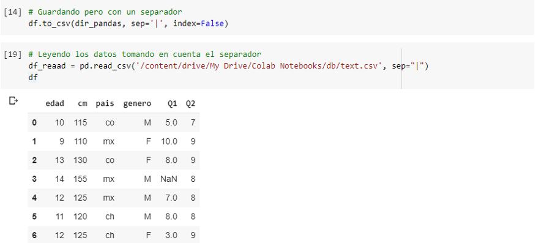

### Clase 6 Conexion con bases de datos tipo SQL

#### Como usar Pandas y Python para conectar con tu base de datos SQL

Pandas cuenta con una funcionalidad que facilita el acceso a tus bases de datos tipo SQL, para ello te mostrare algunos ejemplos:

- **PostgreSQL**:

Valida que tengas la librería **psycopg2** usando el comando import. Si no está instalada en tu ambiente, usa el comando **!pip install psycopg2** en la terminal de python para instalarlo.

Comenzamos cargando las librerías:

```py
import pandas as pd
import psycopg2
```

Luego creamos el elemento de conexión con el siguiente código:

```py
conn_sql = psycopg2.connect(user = "user_name",
                            password = "password",
                            host = "xxx.xxx.xxx.xxx",
                            port = "5432",
                            database = "postgres_db_name")
```

Seguido simplemente definimos nuestra query en SQL:

```py
query_sql = '''
select *
from table_name
limit 10
'''
```

Y creamos nuestro DataFrame:

```py
df = pd.read_sql(query_sql, sql_conn)
df.head(5)
```

- **SQL Server:**

Valida que tengas la librería **pyodbc** usando el comando import, si no está instalada en tu ambiente, usa el comando **!pip install pyodbc** en la terminal python para instalarlo.

Comenzamos cargando las librerías:

```py
import pandas as pd
import pyodbc
```

Luego creamos el elemento de conexión con el siguiente código:

```py
driver = '{SQL Server}'
server_name = 'server_name'
db_name = 'database_name'
user = 'user'
password = 'password'
sql_conn = pyodbc.connect('''
DRIVER={};SERVER={};DATABASE={};UID={};PWD={};
Trusted_Connection=yes
'''.format(driver, server_name, db_name, user, password))
```

O si tienes el DSN:

```py
dsn = 'odbc_datasource_name'
sql_conn = pyodbc.connect('''
DSN={};UID={};PWD={};Trusted_Connection=yes;
'''.format(dsn, user, password))
Seguido simplemente definimos nuestra query en SQL:
query_sql = 'select * from table_name limit 10'
```

Y creamos nuestro dataframe con:

```py
df = pd.read_sql(query_sql, sql_conn)
df.head(5)
```

- **MySQL / Oracle / Otras:**
Valida que tengas la librería **sqlalchemy** usando el comando import, si no está instalada en tu ambiente, usa el comando **!pip install sqlalchemy** en la terminal de python para instalarlo.

Comenzamos cargando las librerías:

```py
import pandas as pd
import sqlalchemy as sql
Escogemos nuestra base de datos, Oracle, MySql o la de tu preferencia:
database_type = 'mysql'
database_type = 'oracle'
```

Luego creamos el elemento de conexión con el siguiente código:

```py
user = 'user_name'
password = 'password'
host = 'xxx.xxx.xxx.xxx:port'
database = 'database_name'

conn_string = '{}://{}:{}@{}/{}'.format(
database_type, user, password, host, database)

sql_conn = sql.create_engine(conn_string)
```

Seguido simplemente definimos nuestra query en SQL:

```py
query_sql = '''
select *
from table_name
limit 10
'''
```

Y creamos nuestro DataFrame con:

df = pd.read_sql(query_sql, sql_conn)
df.head(5)

La librería sqlalchemy también soporta PostgreSQL y otras fuentes de datos.

### Clase 7 Ventajas y desventajas de los formatos de importar y guardado

Continuando con la clase anterior ahora lo haremos en otros formatos como excel, json,pkl, etc.

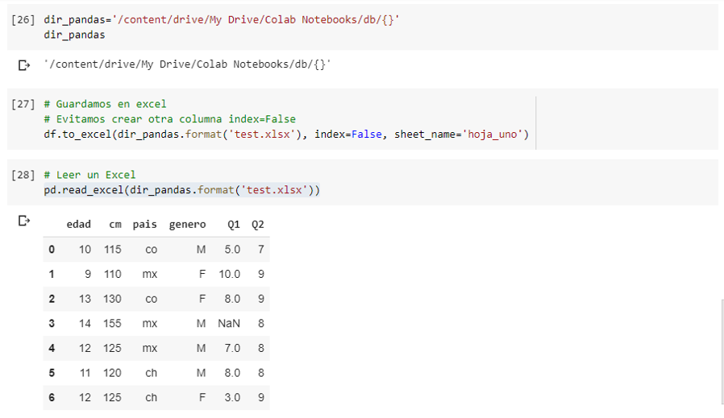

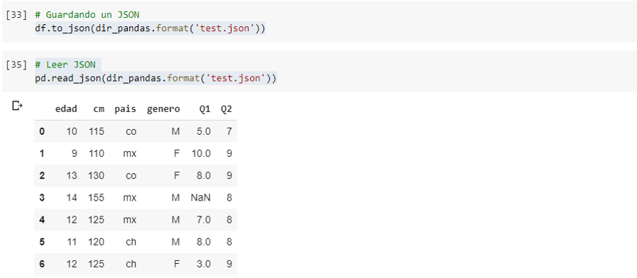

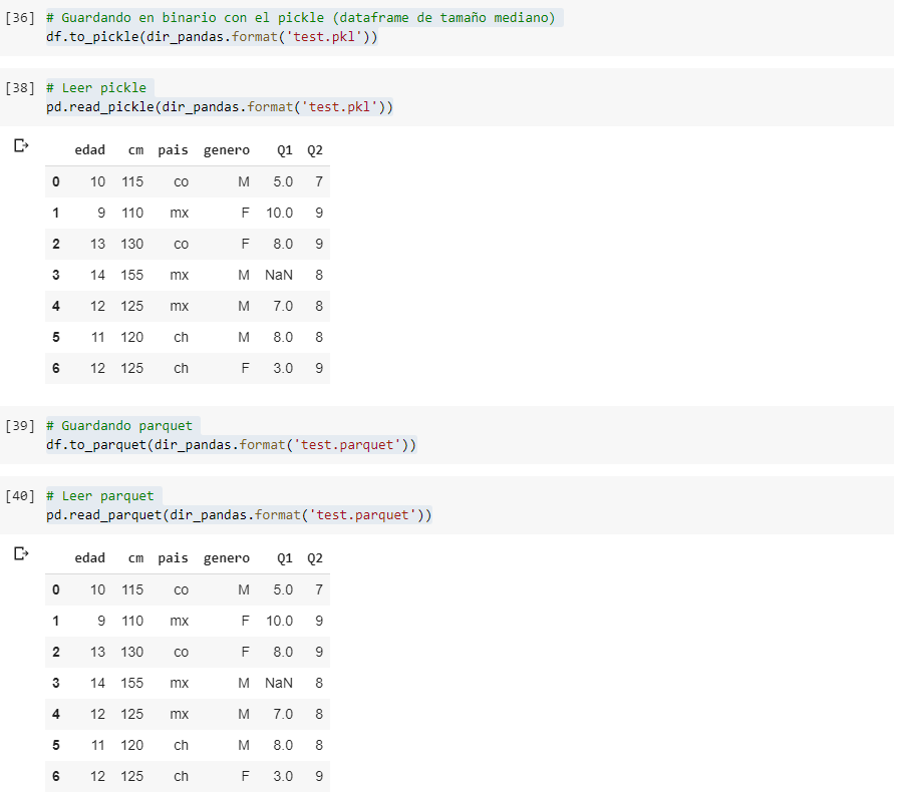

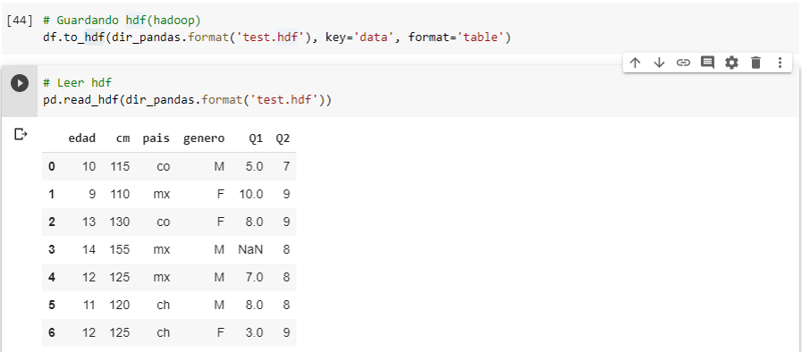

SI observas tu carpeta en colab, cada archivo tiene un peso diferente aunque es la misma data, mira en la [documentación oficial](https://pandas.pydata.org/pandas-docs/stable/user_guide/io.html)mas información sobre guardar información en los diferentes formatos

## Modulo 2 Funcionalidades basicas y esenciales de pandas

### Clase 8 Formatos de lectura para cargar y guardar DataFrames

**Esta clase es muy importante** el profesor preparo un script para generar un DataFrame de mas de 100 mil registros y 30 columna (las primeras 15 con formato numérico,las restantes tipo texto), aquí los resultados al guardar.

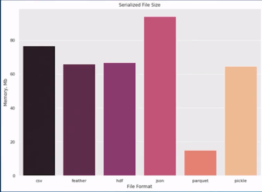

Si hacemos una categorización de las variables, la compresión aumenta

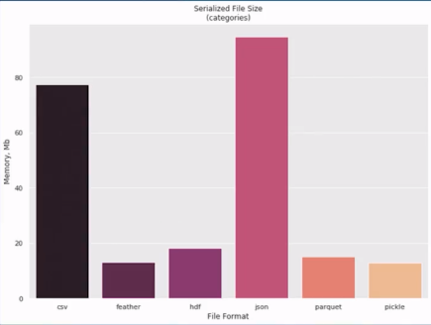

En cuanto a tiempos de carga y lectura vemos el gráfico

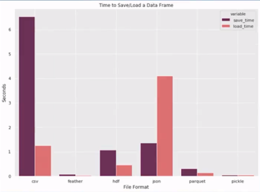

Uso y Picos de Memoria

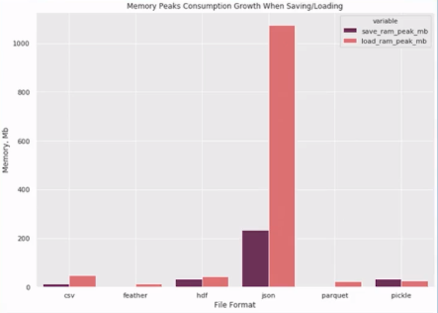

Si estamos trabajando con una base de datos de al rededor de 1gb es mejor usar pickle, que resulta ser rápido y versátil.

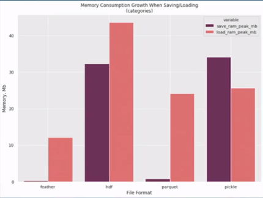

### Clase 9 Tipos de Variables que componen un data frame


### Clase 10 Estructuras de dataframes en detalle

Podemos utilizar [DataSearch de google](https://datasetsearch.research.google.com/) para buscar archivos csv. Para esta clase buscamos una sobre meteoritos y la guardamos con las otras bases de datos del curso.

- **Cargamos el DataFrame**

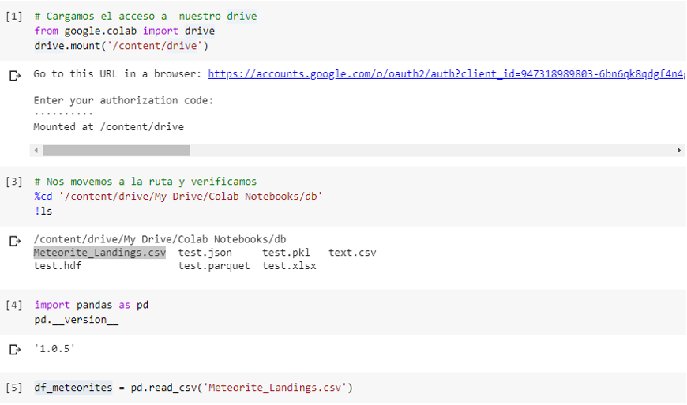

- **Visualizamos los datos**

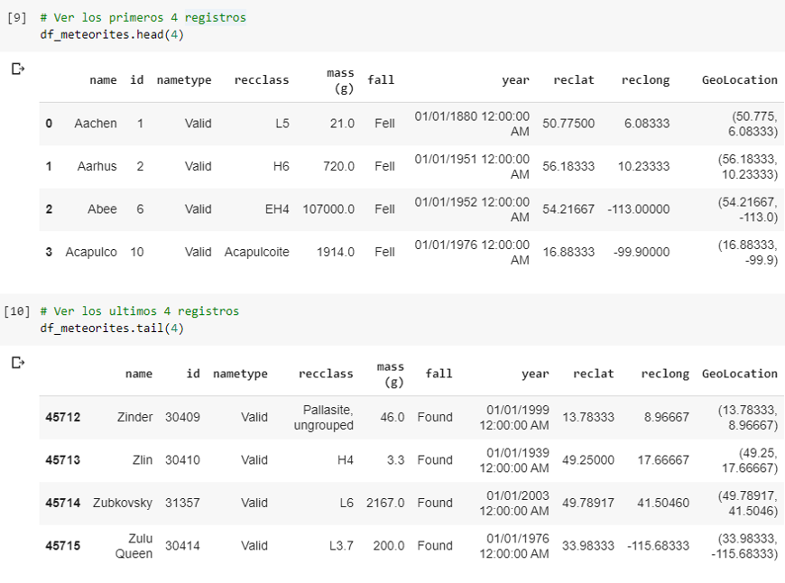
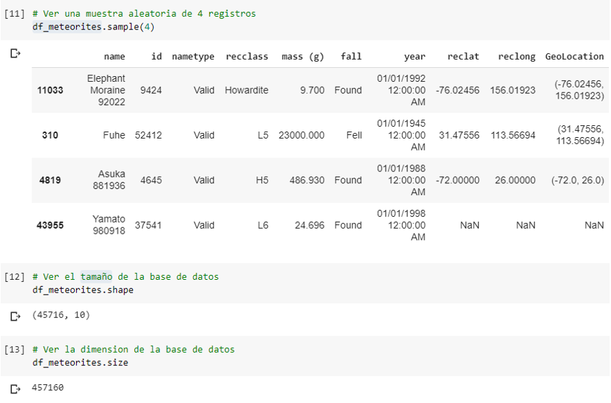

- **Visualizamos con Describe()**

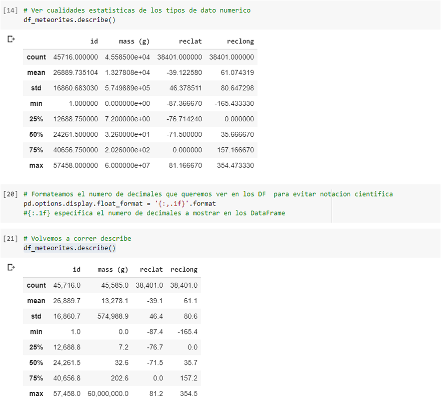
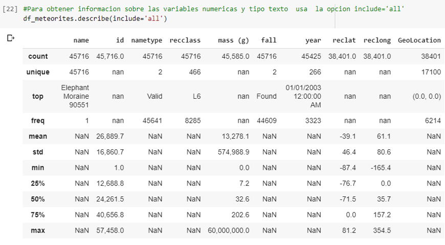

- **Visualizamos Categorías y tipos de datos**

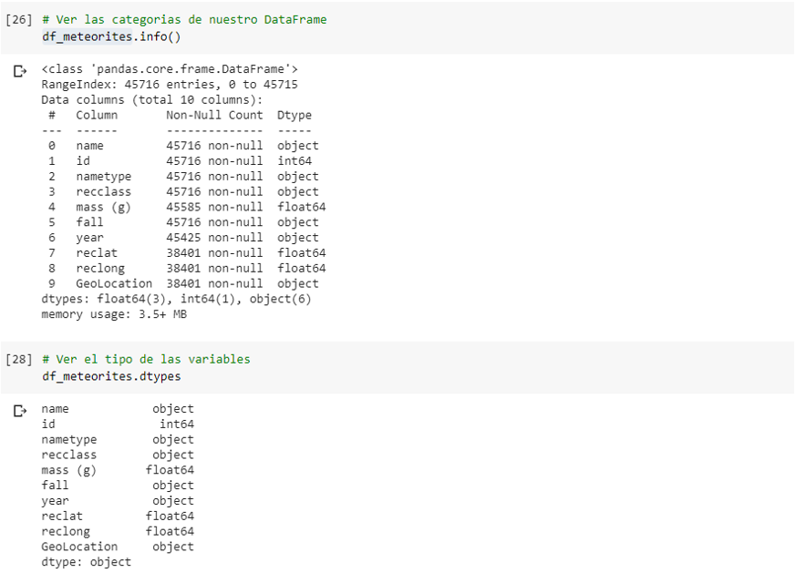

- **Conversion de pandas en  los tipos de datos**

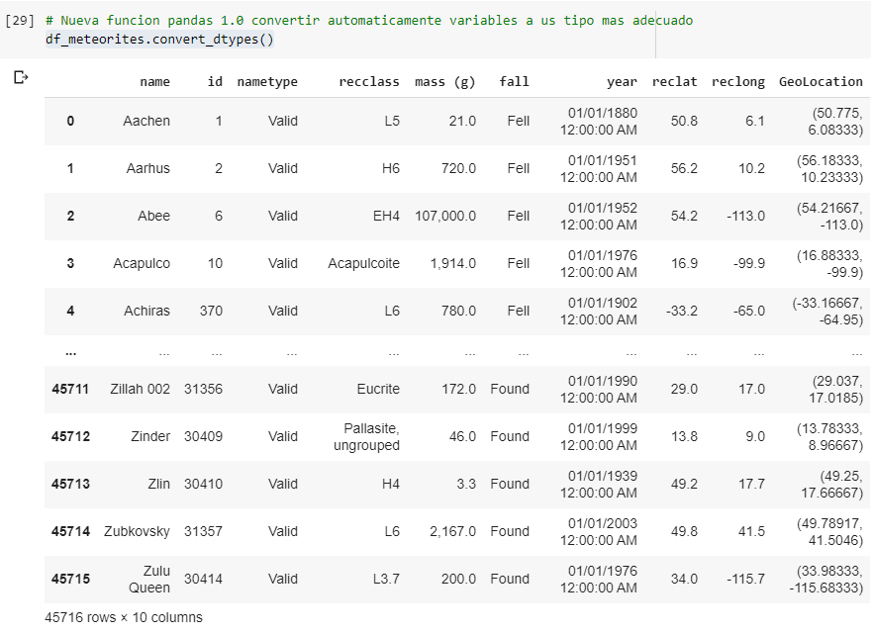

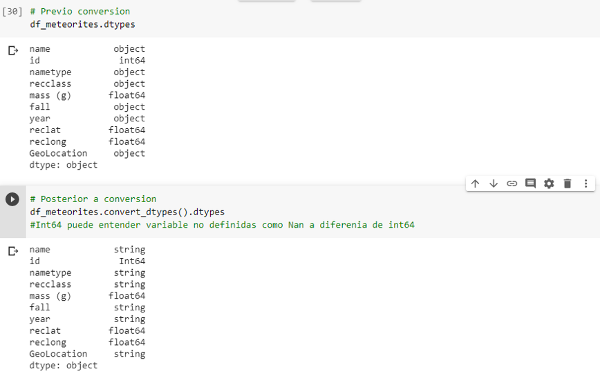

### Clase 11 Borrar filas, columnas y copiar información

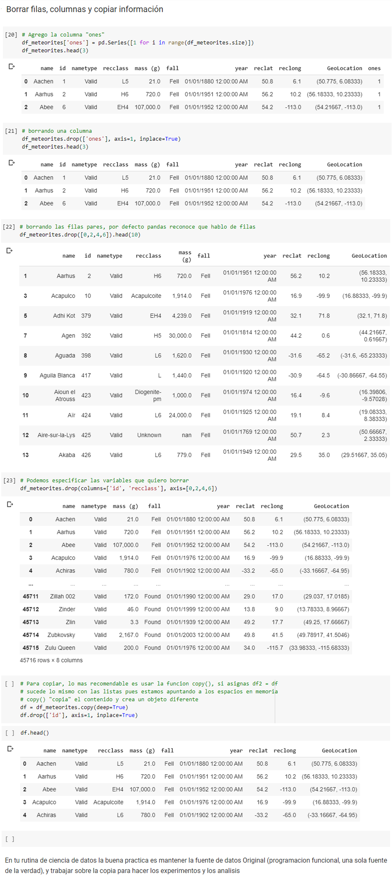

## Modulo 3 Aplicando pandas

### Clase 12 Funciones matematicas

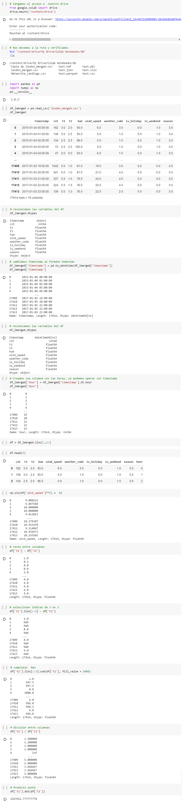

### Clase 13 De paneles de datos al DataFrame

Para esta clase descargamos el csv de este enlace <https://www.kaggle.com/hmavrodiev/london-bike-sharing-dataset>


### Clase 14 Funciones mas complejas y lambdas


### Clase 14 Multiples índices

Descargamos la base de datos population de <https://data.worldbank.org/>

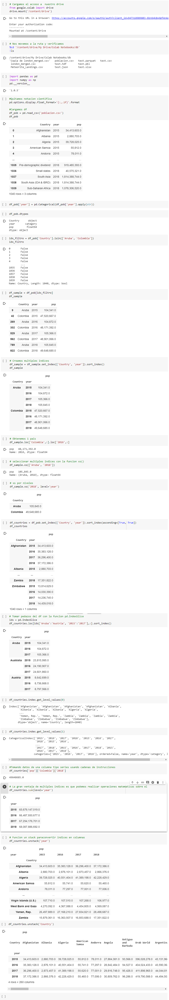

### Clase 15 Cómo trabajar con variables tipo texto en Pandas

Pandas cuenta con una gran funcionalidad a la hora de interactuar con texto, es super versatil si estas interesado en crear modelos de análisis de lenguaje natural.

Comencemos cargando nuestra librería y creando un diccionario con nombres de personas.

```py
import pandas as pd
data = {'names':['Sara Moreno 34',
                 'jUAn GOMez 23',
                 'CArlos mArtinez 89',
                 'Alfredo VelaZques 3',
                 'luis Mora 56',
                 '@freddier #platzi 10',pd.NA]}
```

Usemos los datos del diccionario para crear nuestro DataFrame. Nuestro DataFrame contiene una columna tipo texto, con variedades de caracteres especiales, números, mayúsculas e inclusive variables nulas.

```py
df = pd.DataFrame(data)
df
```

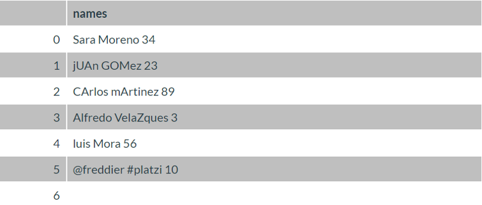

Para usar las funciones asociadas a texto usamos str en nuestro DataFrame, por ejemplo, si se quiere colocar el texto en minúscula, basta con escribir:

```py
df['names'].str.lower()
```

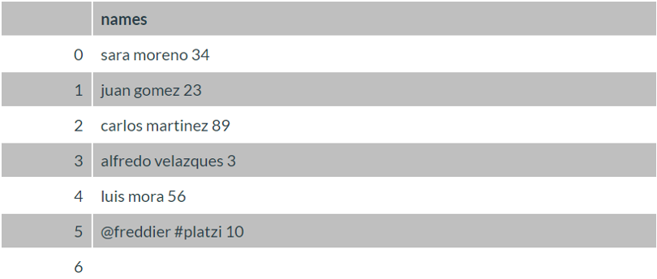

Para mayúsculas igualmente:

```py
df['names'].str.upper()
```

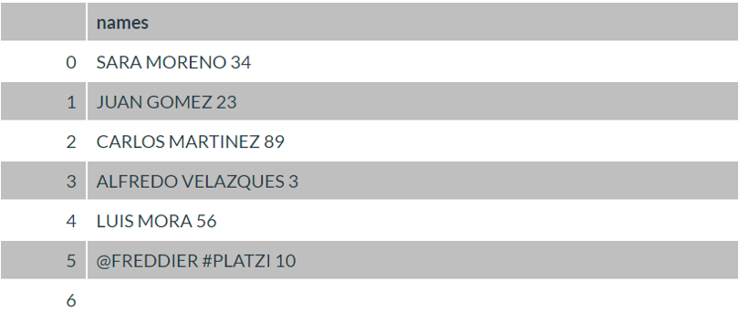

O si queremos solo la primera letra en mayúscula:

```py
df['names'].str.capitalize()
```

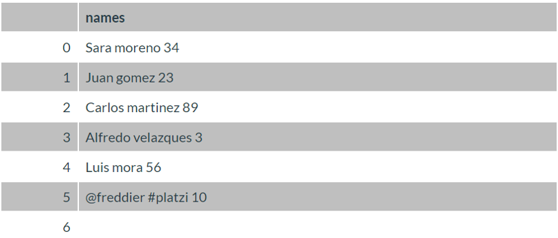

Para contar la longitud de nuestro texto usamos:

```py
df['names'].str.len()
```

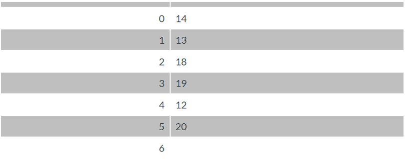

Para dividir el texto por espacios usamos `split` y definimos el carácter por
el que queremos dividir, en este caso, un espacio vacío `' '` o `'#'`:

```py
df['names'].str.split(' ')
```

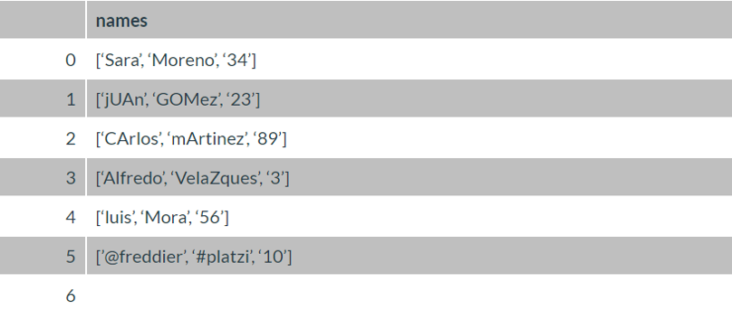

Para seleccionar los primeros o últimos 5 caracteres usamos:

```py
df['names'].str[:5]
```

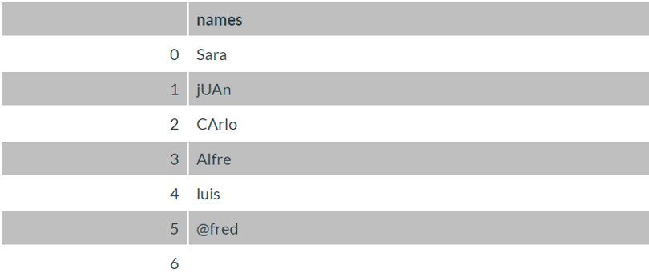

```py
df['names'].str[-5:]

```

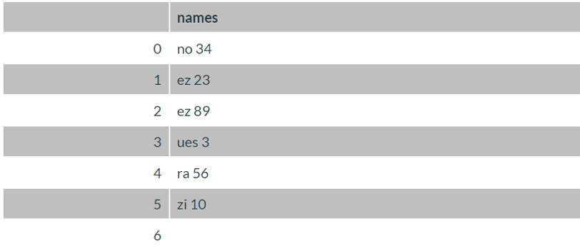

Podemos reemplazar una secuencia de caracteres por otra mediante:

```py
df['names'].str.replace('Alfredo','Antonio')
```

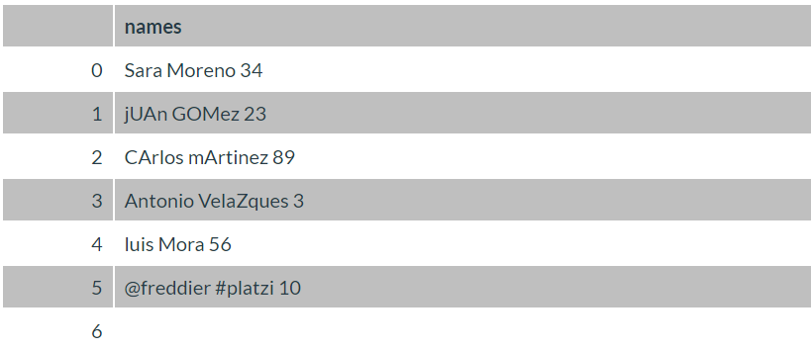

También podemos buscar una secuencia de texto en específico, en este caso, `'ara'`:

```py
df['names'].str.findall('ara')
```

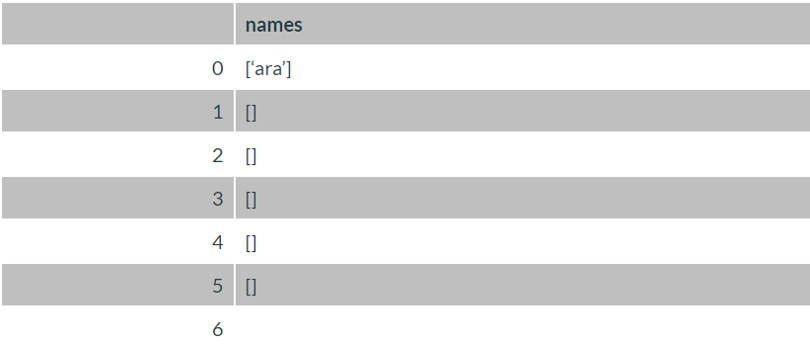

También podemos crear un filtro basándonos en una secuencia de texto en específico, en este caso, las filas que tengan `'or'`:

```py
df['names'].str.contains('or')
```

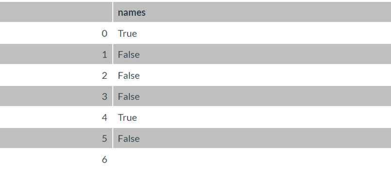

Así mismo, podemos contar el número de ocurrencias de un caracter en específico, por ejemplo, cuántas veces aparece la letra 'a':

```py
df['names'].str.lower().str.count('a')
```

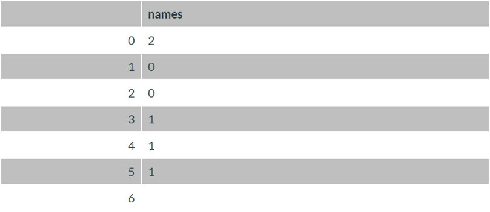

Existen comandos más avanzados usando Regex, por ejemplo, si quiero extraer los caracteres numéricos:

```py
df['names'].str.extract('([0-9]+)', expand=False)
```

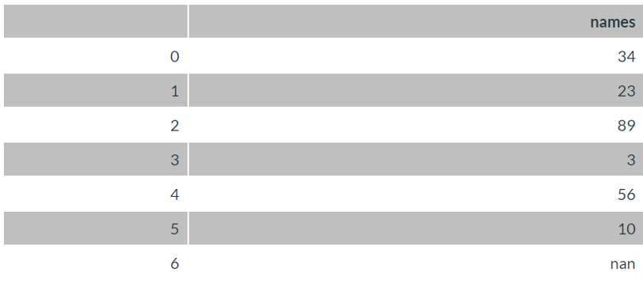

O, por ejemplo, si quiero extraer las menciones `'@xxxx'` del texto:

```py
df['names'].str.replace('@[^\s]+','')
```

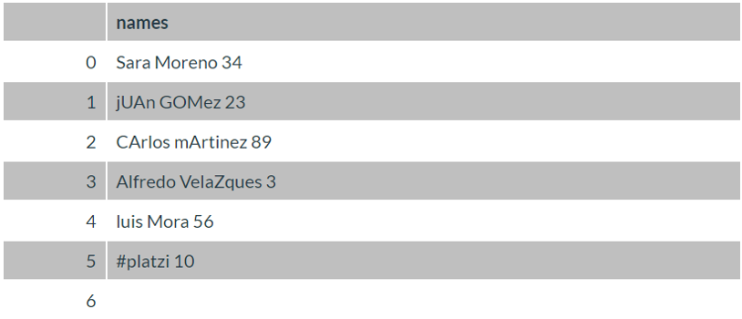

### Clase 16 Concatenación de DataFrames: concat y append

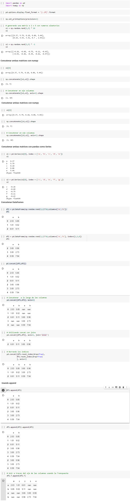

### Clase 17 Merge de DataFrames

Hablaremos de como hacer marge entre dos Datasets, este tipo de concatenación se da cuando dos DataFrames  tienen una columna en común, esto es muy util cuando tienes fuentes de daos diferentes y quieres unificarlos a traves de un parámetro que se comparte entre ellos.


### Clase 18 omo lidiar con datos faltantes en tus DataFrames

Es muy común que nuestros DataFrames presenten datos faltantes, antes de empezar a procesar nuestros DataFrames veamos un poco en qué consisten los objetos NaN (Not a Number).

Importemos las librerías Pandas y Numpy para esto:

```py
import numpy as np
import pandas as pd
```

Un número que no está definido usualmente se representa con el siguiente objeto:

```py
np.nan
> nan
```

¡Este objeto tiene propiedades matemáticas! Al sumar un número, obtenemos como respuesta el mismo NaN.

```py
np.nan + 0
> nan
```

```py
np.nan > 0
> False
```

La versión 1.0 de pandas incluye un nuevo objeto NA, que es mucho más general pues, ademas de interactuar con números, tambien puede hacerlo con cadenas de texto u otras varaibles como las de tipo booleano. Si quieres que esta nueva definición este incluida entre tus cálculos usa:

```py
 pd.options.mode.use_inf_as_na = True
```

Al sumar NA a una cadena de texto, obtengo el mismo NA:

```py
pd.NA +'Hola mundo'
> <NA>
```

```py
pd.NA | False
> <NA>
```

A continuación, vamos a crear un DataFrame

```py
df = pd.DataFrame(np.arange(0, 15).reshape(5, 3), columns=['a', 'b', 'c'])
df
```

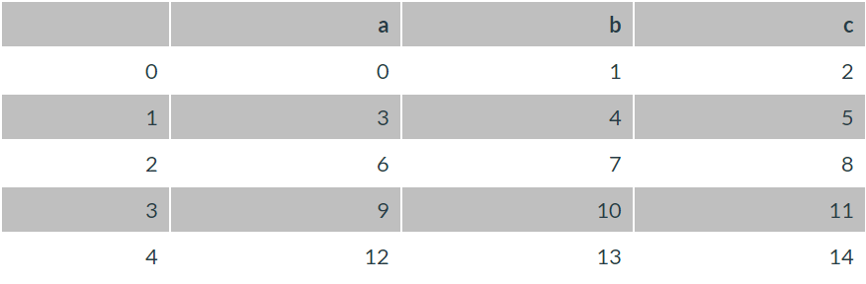

Y vamos a añadir algunas variables no definidas:

```py
df['d'] = np.nan
df['e'] = np.arange(15, 20)
df.loc[5,:] = pd.NA
df.loc[4,'a'] = pd.NA
df.loc[0,'d'] = 1
df.loc[5,'d'] = 10
df
```

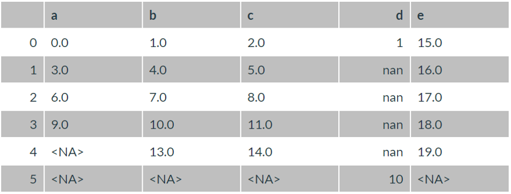

Para reconocer cuando un objeto es nulo simplmente usamos:

```py
df.isnull()
```

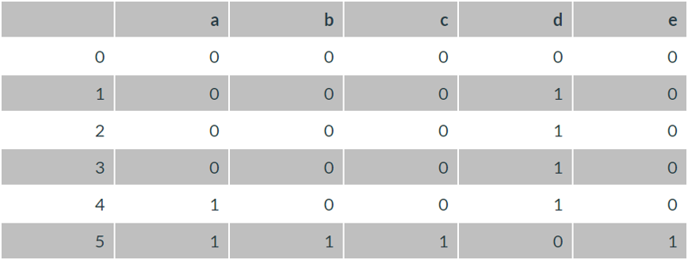

En dónde todas nuestras variables no definidas fueron marcadas con TRUE, `df.isna()` también cumple esta función.

Conocer el número de variables nulas por columna puede hacerse juntando el
comando anterior con la funcion de suma:

```py
df.isnull().sum()
```

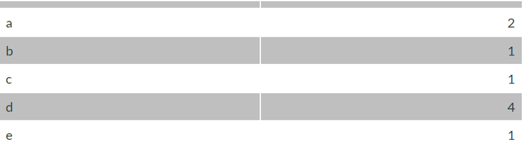

Si lo que nos interesa es conocer el número de filas con elementos nulos, basta
con usar axis=1:

```py
df.notnull().sum(axis=1)
```

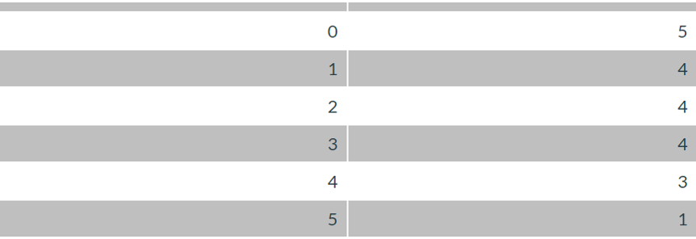

O todos los elementos nulos de nuestro DataFrame:

```py
df.size-df.isnull().sum().sum()
```

```py
21
```

Reconocer estos elementos nos puede ayudar a filtrar en nuestro DataFrame, en este caso, me gustaría filtrar por las variables no nulas de la columna ‘a’:

```py
df[df['a'].notnull()]
```

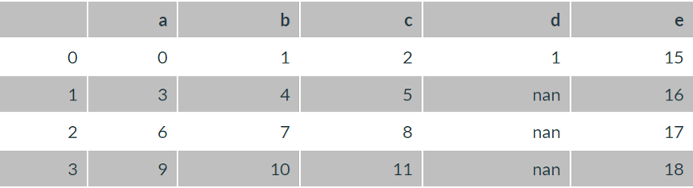

``dropna`` es perfecto para elimnar rapidamente las filas con registros faltantes:

```py
df.dropna()
```


```py
df[['a']].dropna()
```


Ya que hemos visto cómo funcionan las variable nulas, veamos cómo lidiar con ellas. Usando la función ``fillna`` podremos reemplazarlas por el valor que querramos, en este caso 0.

```py
df.fillna(0)
```


Si quisieramos remplazar con el valor siguiente usamos method="ffill":

```py
df.fillna(method="ffill")
```

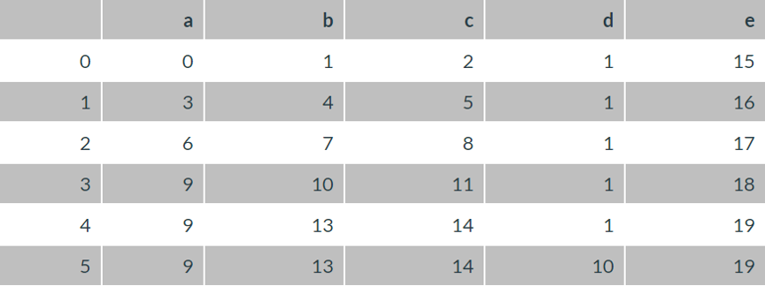

Si quisieramos remplazar con el valor previo usamos `method="bfill"`:

```py
df.fillna(method="bfill")
```

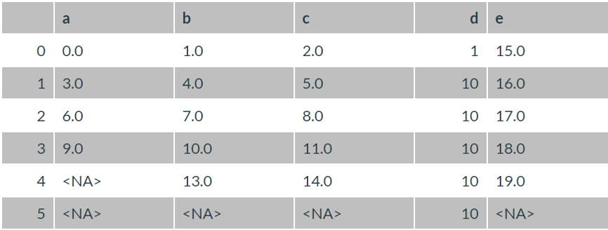

El mismo ejercicio anterior se puede aplicar con las filas usando axis=1:

```py
df.fillna(method="bfill",axis=1)
```

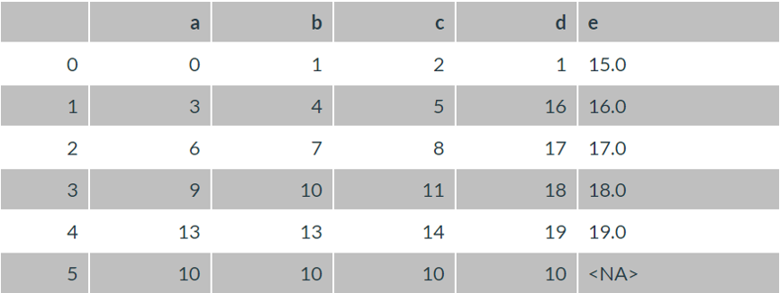

Podemos usar también una serie para reemplazar los valores de una columna en especifico, es importante que haya emparejamiento entre los índices:

```py
fill = pd.Series([100, 101, 102])
fill
```


```py
df['d'] = df['d'].fillna(fill)
df['d'] 
```

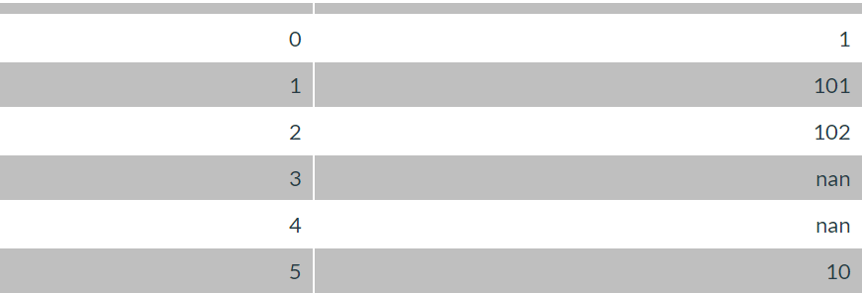

```py
df
```

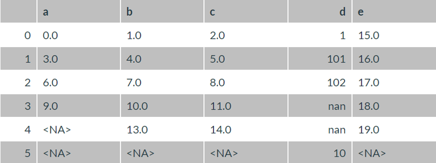

Una de las formas más usadas para reemplazar datos es usar el promedio de las columnas, esto se hace con la función `mean`. O si se quiere un mejor estimador, usamos `median`.

```py
df.fillna(df.median())
```

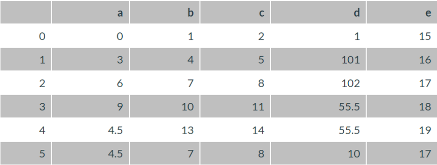

Por último, Pandas también puede interpolar los valores faltantes calculando el valor que puede haber existido en el medio.

```py
df_d = pd.concat([df[['d']], df[['d']].interpolate()],axis=1)
df_d.columns = ['d_antes','d_interpolado']
df_d
```

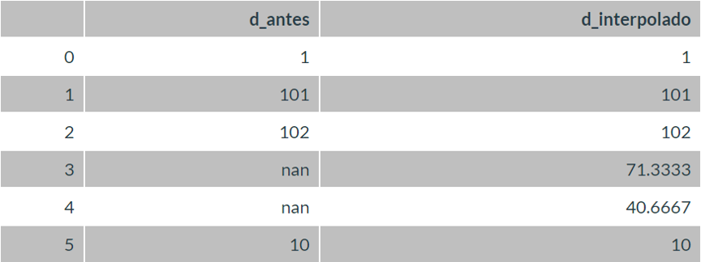

### Clase 19 Group by

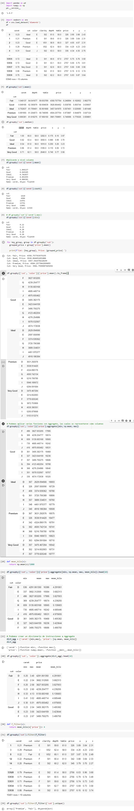

### Clase 20 Como lidiar con datos duplicados en Pandas

Es muy usual que los registros de una base de datos aparezcan más de una vez, así que veamos cómo pandas puede ayudarnos a lidiar con estos casos. Para comenzar, importemos pandas y creemos un DataFrame con dos columnas y algunos datos repetidos.

```py
import pandas as pd
```

```py
df = pd.DataFrame({'a': ['w'] * 4 + ['x'] * 3 + ['y'] * 2 + ['z']+['v'], 
                   'b': [1, 1, 1, 1, 2, 2, 2, 3, 3, 4,5]})
df
```

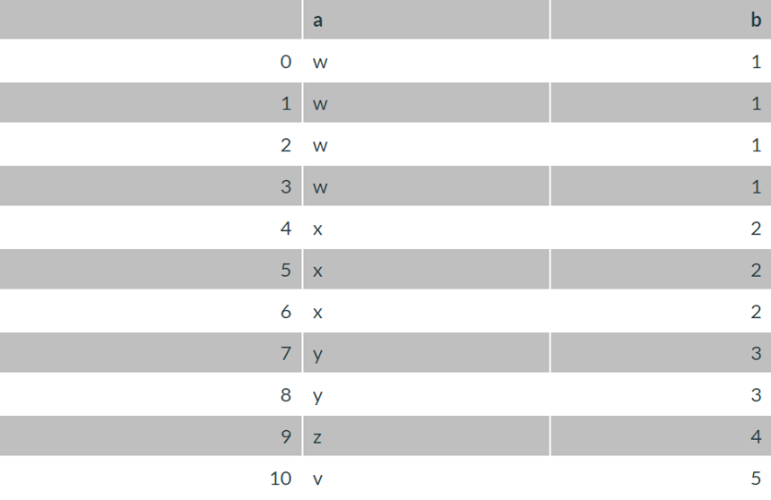

Para encontrar los registros duplicados usamos `duplicated` , que marca con True aquellos casos de filas duplicadas:

```py
df.duplicated()
```


Podemos usar `keep='first'` para marcar solo la primera ocurrencia o `keep='last'` para marcar la última:

```py
df.duplicated(keep='first')
```

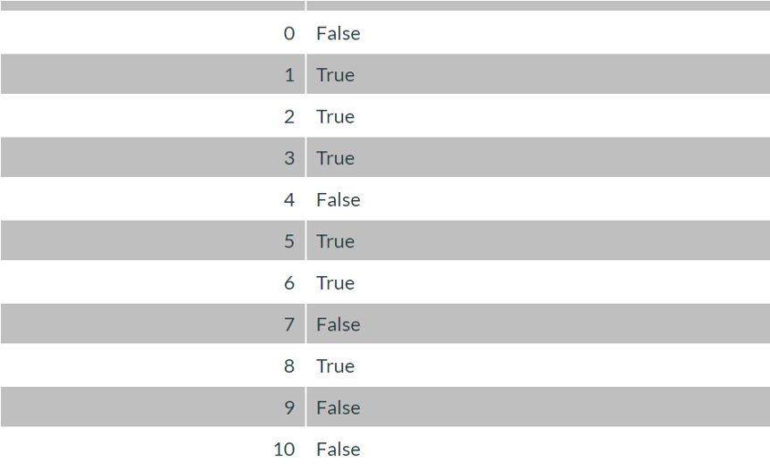

```py
df.duplicated(keep='last')
```

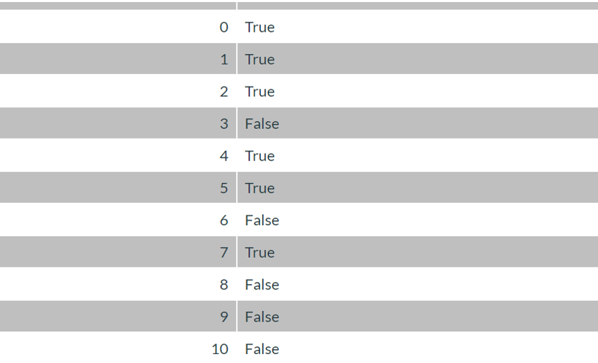

Identificados los casos duplicados, podemos usar este resultado para filtrar y seleccionar aquellos que no tienen un registro duplicado:

```py
df[~ df.duplicated()]
```


Si quisieras dejar el primer registro de los duplicados o el último, recuerda usar `keep='first'` o `keep='last'`. Remarco el hecho de que usé negación `'~'` para ver los registros no duplicados.

Y si me interesara ver cuáles son los registros duplicados, podemos usar `keep=False`:

```py
df.duplicated(keep=False)
```

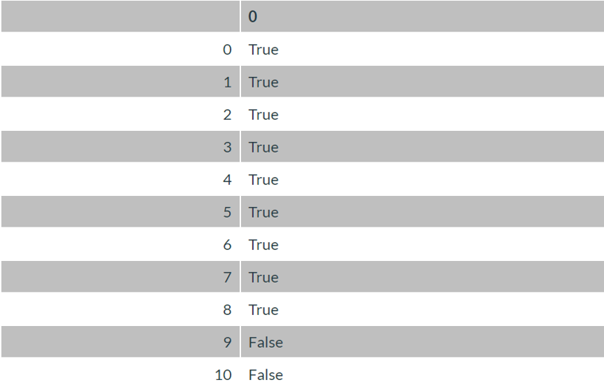

```py
df.duplicated(keep=False)
```

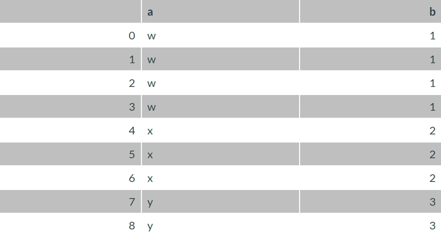

Por último, puedes usar el comando `'drop_duplicates'` para eliminar los duplicados. Por defecto, la función guarda el primer resultado `keep='first'`:

```py
df.drop_duplicates()
```


Y si quieres solo borrar duplicados teniendo en cuenta una sola columna, lo puedes hacer mediante una lista nombrando las columnas donde vas a eliminar los duplicados, en este caso, ['a']:

```py
df.drop_duplicates(['a'],keep='last')
```


### Clase 21 Aggregation y groupby

La funcion `groupby` nos permite agrupar variables,normalmente categóricas.

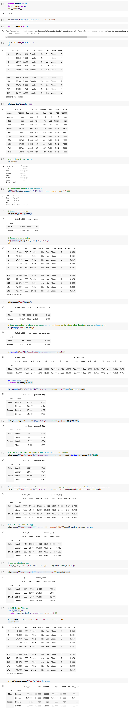

### Clase 22 Group By: extraer valor con variables categóricas

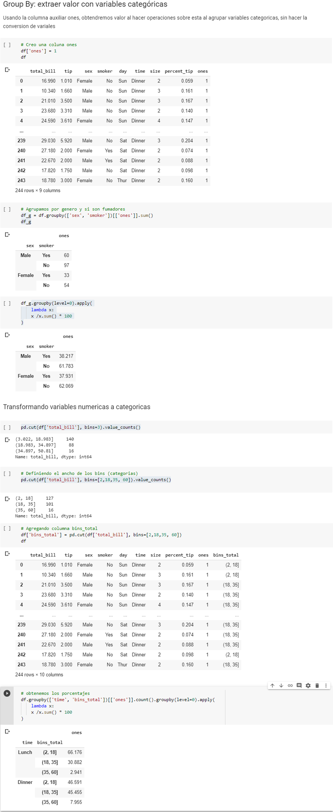

### Clase 23 Tablas dinámicas con Pivot Table

Pandas tiene la funcion `pivot_table` la cual permite extraer información usando variables categóricas de nuestro DataFrame

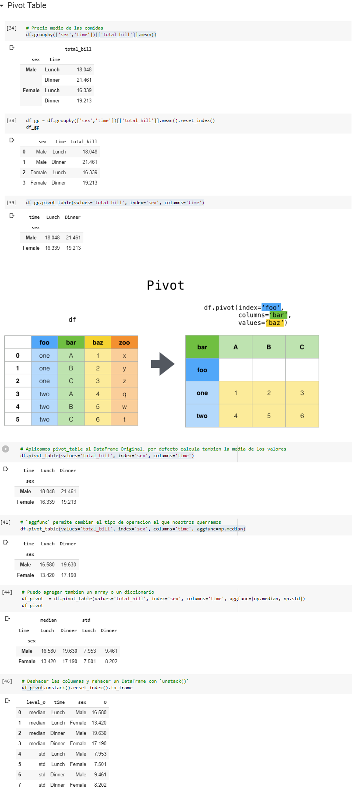

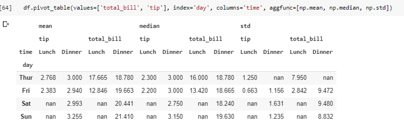

### Clase 24 Series de Tiempo

Descargamos de <https://www.kaggle.com/> el csv de COVID-19

Puedes descargar la version del profesor aquí <https://drive.google.com/drive/folders/1ISJTk7ukyL2Kno9daHsThgt5PkhxoQfx>

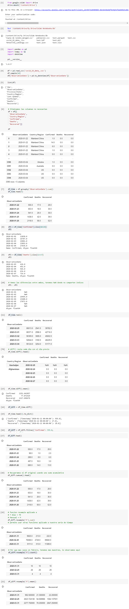

### Clase 25 Series de Tiempo: variables nulas

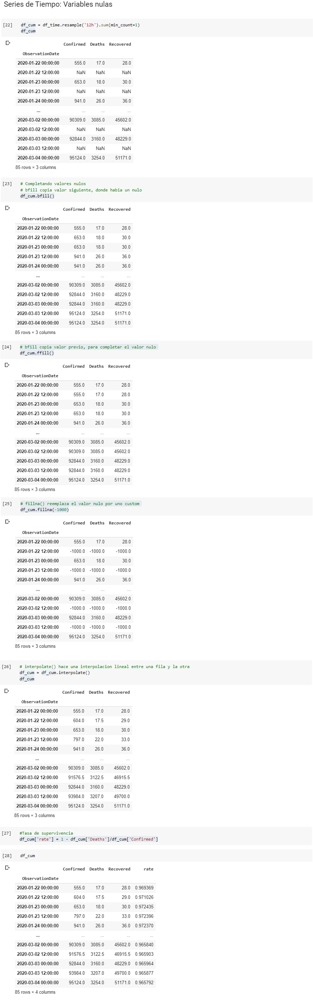
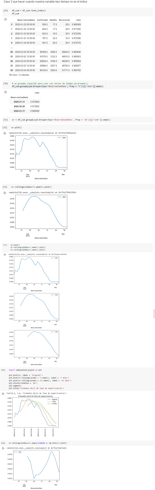

### Clase 26 Visualización y graficacion de datos

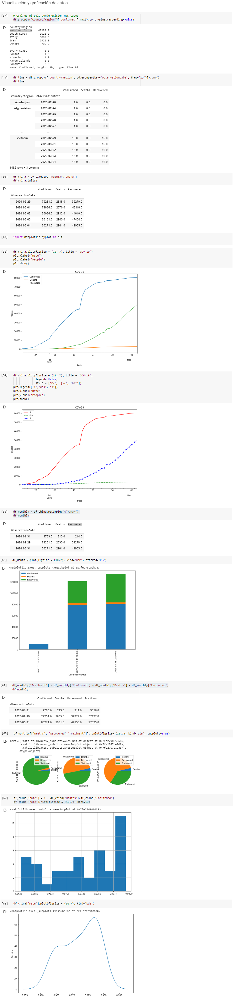

## Modulo 4 Contenido extra

### Clase 27 Iniciando una rutina típica de manejo de datos

Una vez obtenidos  los datos lo primero es realizar el preprocesamiento y limpieza de los datos, consolidar tus archivos en una base simple de análisis y extraer los insights, para los insights lo mejor es usar gráficas.

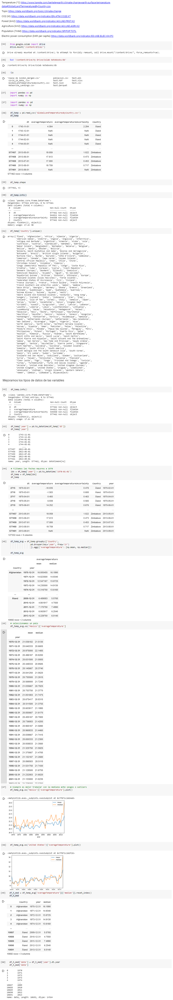
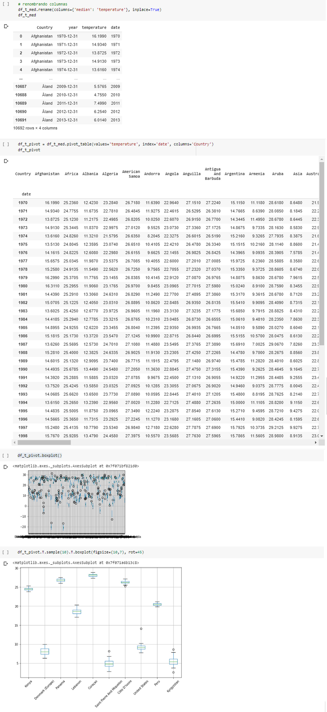

### Clase 28 Preprocesamiento de datos: terminando de preparar y limpiar los datasets

Este proceso lleva entre el 60 y el 70% del tiempo del científico de datos.

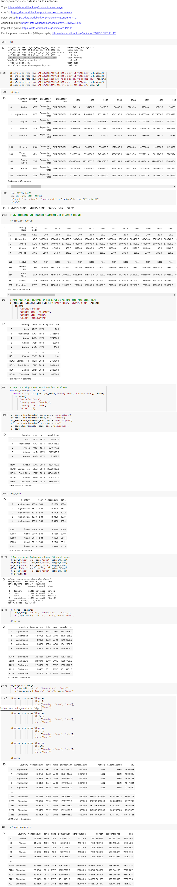

### Clase 29 Análisis de datos

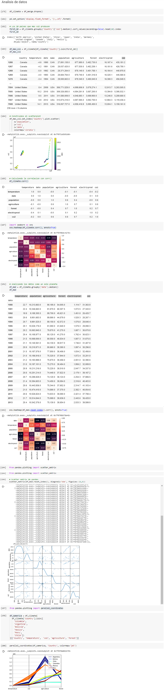